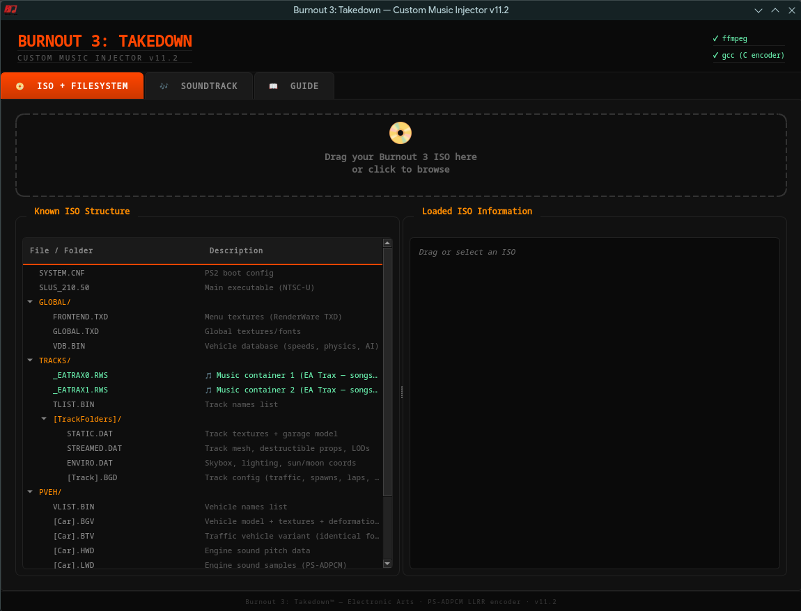
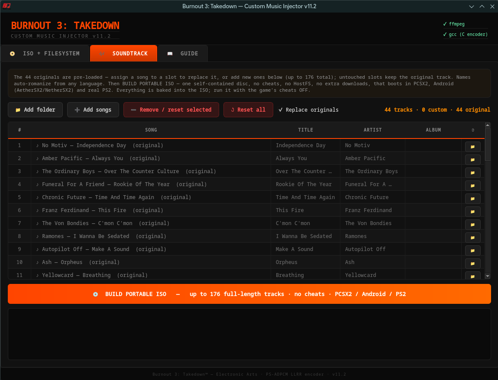

# 🏎️ Burnout 3: Takedown — Custom Music Injector

**Inject your own music into Burnout 3: Takedown (PS2) for PCSX2**


Replace the EA Trax soundtrack with your own music. Supports MP3, FLAC, M4A, OGG, WAV, OPUS, and more. Features a full GUI with drag & drop, automatic PS-ADPCM encoding, surgical ISO patching, and custom song name display.

**One self-contained portable ISO** — up to **176 full-length tracks** (no truncation) with **unlimited romanized names** and working **per-track play-location** (ALL / RACE / MENU / OFF), all baked into a single ISO that boots on **PCSX2, Android (AetherSX2/NetherSX2), and real PS2 — with zero cheats**.

## 🎬 Demo

[](https://www.youtube.com/watch?v=bScxPc_APYo)

*Click to watch gameplay with custom music injected*

## 📸 Screenshots

### ISO + Filesystem


### Track Assignment + Processing


## ✨ Features

- **Up to 176 tracks** — Replace any or all of the 44 EA Trax songs *and* add new ones, all baked into one self-contained ISO (a digit=track/22 ELF hook + a relocated 24-byte metadata array in a code cave, CRC-neutralised so the game still boots and keeps its graphics fixes)
- **Full-length tracks** — A surgical ISO builder relocates the enlarged EATRAX/GLOBALUS files to the disc end (every other file stays byte-identical at its original LBA), so songs play at full length with **no cheats** — the ISO boots anywhere
- **Per-track play-location** — Set each track's **ALL / RACE / MENU / OFF** in the in-game EA Trax menu — works for every track, not just the original 44 (the menu object was extended via reverse engineering so big playlists don't crash or garble)
- **Unlimited romanized names** — Relocated GLOBALUS string table removes the per-field length limit; a built-in romanizer (ICU `Any-Latin; Latin-ASCII` + pykakasi for Japanese) converts foreign-script titles to readable Latin/romaji automatically
- **Custom song names** — Title, Artist, and Album display in-game via GLOBALUS.BIN patching (UTF-16LE)
- **Auto metadata** — Title/Artist/Album auto-fill from audio file tags (ID3, Vorbis, etc.)
- **Any audio format** — MP3, FLAC, M4A, OGG, WAV, OPUS, WMA, AAC
- **PS-ADPCM encoder** — C-accelerated encoder with a full filter/shift search (5 filters × 13 shifts = 65 combos per block, no heuristic → no quantization clicks), integer-accurate predictor feedback
- **Multicore pipeline** — every song is converted and encoded in parallel across all CPU cores (~7× faster encoding on an 8-core machine)
- **Loudness matching** — 2-pass loudnorm brings custom music up to EA Trax's hot master level so it doesn't sound weak next to the original soundtrack
- **LLRR stereo layout** — Correct super-block format verified through reverse engineering
- **Dynamic RWS patching** — Track sizes in the RWS header are updated to match actual (full) audio length
- **Surgical ISO patching** — Keeps every original file byte-identical at its LBA and relocates only the enlarged track/name files to the disc end (no full rebuild → boots on PCSX2, Android and real PS2)
- **Output selector** — Choose where to save the custom ISO
- **Drag & drop GUI** — PySide6/Qt6 interface with dark theme
- **Cross-platform** — Linux and Windows support

## 🔧 Installation

### Arch Linux
```bash
sudo pacman -S ffmpeg gcc python-pyside6
```

### Ubuntu / Debian
```bash
sudo apt install ffmpeg gcc python3-pip
pip install PySide6
```

### Windows
Install [Python](https://python.org), [ffmpeg](https://ffmpeg.org/download.html) and [MinGW](https://www.mingw-w64.org/) (for gcc). Then:
```bash
pip install PySide6
```

### Run
```bash
python3 burnout3_gui.py
```

The C encoder (`psxadpcm.c`) auto-compiles on first run via `gcc`. If `gcc` is not available, a Python fallback is used (slower).

## 📖 How to Use

1. **Load ISO** — Drag your Burnout 3: Takedown ISO (NTSC-U SLUS-21050 or PAL SLES-52585) to the ISO tab — the region is auto-detected
2. **Assign Music** — Go to the **SOUNDTRACK** tab. The 44 originals are pre-loaded — replace any, or add new ones (up to 176 total). Title/Artist/Album auto-fill from metadata and auto-romanize.
3. **Build** — Click **💿 BUILD PORTABLE ISO**
4. **Play** — Load the resulting ISO in PCSX2, Android (AetherSX2/NetherSX2), or a real PS2 — everything is baked into the disc

## 🎶 How It Builds

Everything lives in the single **`🎶 SOUNDTRACK`** tab (pre-loads the 44 originals; replace any, add up to 176), with one build button:

| Build button | Tracks | Length | Names | Per-track play-loc | Cheats? | Runs on |
|------|--------|--------|-------|------|------|------|
| 💿 **BUILD PORTABLE ISO** | **1–176** | **full** | **unlimited (romanized)** | ✅ | **none** | PCSX2 / Android / PS2 |

> **How?** Burnout 3 reads its loose disc files by **fixed LBA**, so a normal ISO rebuild black-screens. The builder works around this surgically: it keeps every original file byte-identical at its LBA and relocates only the (enlarged) path-opened EATRAX/GLOBALUS files to the disc end. For **>44 tracks** it also bakes the whole EA-TRAX expansion (a digit ELF hook + a relocated metadata array in a freed code cave + the per-track play-location fixes) straight into the ELF, then **XOR-compensates so the game CRC stays `0xBEBF8793`** — so PCSX2 keeps Burnout 3's graphics fixes and the disc still boots. No cheats, nothing to download. See [`BURNOUT3_EATRAX_HANDOFF.md`](BURNOUT3_EATRAX_HANDOFF.md) for the reverse-engineering write-up.

## 🎵 Audio Format Details

| Property | Value |
|----------|-------|
| Codec | PS-ADPCM (PlayStation 2 native) |
| Sample Rate | 32,000 Hz |
| Channels | Stereo |
| Layout | LLRR (8192-byte super-blocks) |
| Block | L[2048] L[2048] R[2048] R[2048] |
| Nibble Order | First sample = LOW nibble, Second = HIGH |
| Compression | 3.5:1 (56 bytes PCM → 16 bytes ADPCM) |
| Encoder | 5 filters × 13 shifts = 65 combos per block (full search) |
| Pre-filter | Lowpass 15.5kHz (just under Nyquist) — keeps highs, tames aliasing |
| Resampler | soxr, 28-bit precision |
| Loudness | 2-pass loudnorm ~-10 LUFS — matches EA Trax's hot masters |

## 📊 Tracks & Files

Tracks are grouped **22 per file**: `_EATRAX0.RWS` = 1–22, `_EATRAX1.RWS` = 23–44, then `_EATRAX2 / 3 / 4 …` for tracks 45+ — up to **8 files = 176 tracks** (the digit router + the `.rws` filename string cap it there).

- Every file is rebuilt at the **full length** of its songs — no truncation, no fade-out.
- The enlarged files are relocated to the disc end, so the only cost of more (or longer) songs is a **bigger ISO** — never a silenced or cut song.

## 🏷️ Song Names

Custom names (Title / Album / Artist) are written into `DATA/GLOBALUS.BIN` inside the ISO:

- **No length limit** — the tool **relocates the string-pointer table to a larger buffer appended at the file end** and repoints each name there, so the old fixed-size slots (and their truncation) are gone. Names can be any length.
- **Encoding**: UTF-16LE. Latin characters render perfectly. The NTSC-U font has **no CJK glyphs**, so Japanese/Chinese/Korean titles are **auto-romanized** (ICU `Any-Latin; Latin-ASCII` + pykakasi for Japanese) to readable Latin/romaji instead of showing as squares.

## 🔬 Technical Notes

### RWS Container Format
The music is stored in `TRACKS/_EATRAX0.RWS` (tracks 1-22) and `TRACKS/_EATRAX1.RWS` (tracks 23-44) inside the ISO; tracks 45+ go in newly-added `_EATRAX2/3/4…` files (up to 8).

```
RWS Container (0x080D) {
  Audio Header (0x080E) {
    Track table @ 0x78: 32-byte entries
      [+0x18] track_size    — controls playback duration at runtime
      [+0x1C] track_offset  — cumulative byte offset into audio data
  }
  Audio Data (0x080F) {
    PS-ADPCM blocks in LLRR super-block layout
  }
}
```

Song duration is determined **at runtime** from the track size field in the RWS header — no executable patching required. This was confirmed by the Burnout modding community.

### LLRR Layout
Burnout 3 uses an unusual stereo interleave:
- **Not** standard L[2048] R[2048] alternating
- **Actual**: L[2048] L[2048] R[2048] R[2048] in 8192-byte super-blocks
- Confirmed by decoding original tracks with vgmstream and comparing energy patterns

### Nibble Packing
PS-ADPCM stores two 4-bit samples per byte:
- First sample → **LOW nibble** (bits 0-3)
- Second sample → **HIGH nibble** (bits 4-7)

Verified by byte-comparison against decoded/re-encoded original tracks.

## 📋 Known Limitations

- **176-track ceiling** — The digit file-router and the `.rws` filename string cap the expansion at 8 `_EATRAX` files (8 × 22 = 176 tracks).
- **4-bit audio is the format's ceiling** — PS-ADPCM is the PS2's native codec (32 kHz, ~4 bits/sample), the *same* as the original EA Trax tracks. The encoder is near-optimal for it, but extremely bright / high-pitched masters can still sound a bit grainy on the loudest highs — that's the format, not the encoder.
- **NTSC-U & PAL (Fr/De/It)** — Auto-detects and supports the US version (SLUS-21050) *and* the PAL multi-language version (SLES-52585). NTSC-J and other PAL variants (e.g. SLES-52584) have different offsets and aren't profiled yet.
- **No CJK fonts** — The game's font doesn't include Japanese/Chinese/Korean glyphs, so names are auto-**romanized** to Latin/romaji (which the font renders) instead of showing as squares.

## 🤝 Contributing

Contributions welcome! Areas that need help:

- **NTSC-J / other PAL variants** — Adding the remaining regions (SLPM-65719 Japan, SLES-52584, …) via a new `DISC_PROFILES` entry in `core/portable_iso.py` (the offset-derivation recipe is the one used for PAL)

Already done: ✅ full-length songs, ✅ **up to 176 tracks baked into a self-contained ISO (no cheats)**, ✅ working per-track play-location for big playlists, ✅ unlimited romanized song names, ✅ near-optimal PS-ADPCM encoder, ✅ **NTSC-U + PAL (Fr/De/It) support (auto-detected)**.

## 🙏 Credits & Acknowledgments

- **[Nahelam](https://github.com/Nahelam)** — [PS2-Game-Mods](https://github.com/Nahelam/PS2-Game-Mods) for Burnout 3 modding research (the EA-TRAX metadata layout and the code-cave relocation approach) and community support, which the self-contained expansion builds on.
- **burninrubber0** — RWS format documentation, song metadata research, and invaluable guidance from the [Burnout Wiki](https://burnout.wiki)
- **[AcuteSyntax](https://gist.github.com/AcuteSyntax/536a2d62ab1b3fde5c14f70d268b14c0)** — Burnout modding format documentation
- **vgmstream** — For confirming the audio codec and sample rate
- **EA / Criterion Games** — For making Burnout 3: Takedown, one of the greatest racing games ever

## 📄 License

MIT License

---

*This tool was developed with the assistance of AI (Claude by Anthropic) as a coding partner. The reverse engineering, testing, and verification were performed iteratively on real hardware/emulator setups.*

*This tool is for personal use with legally owned copies of Burnout 3: Takedown. No copyrighted game data is included.*