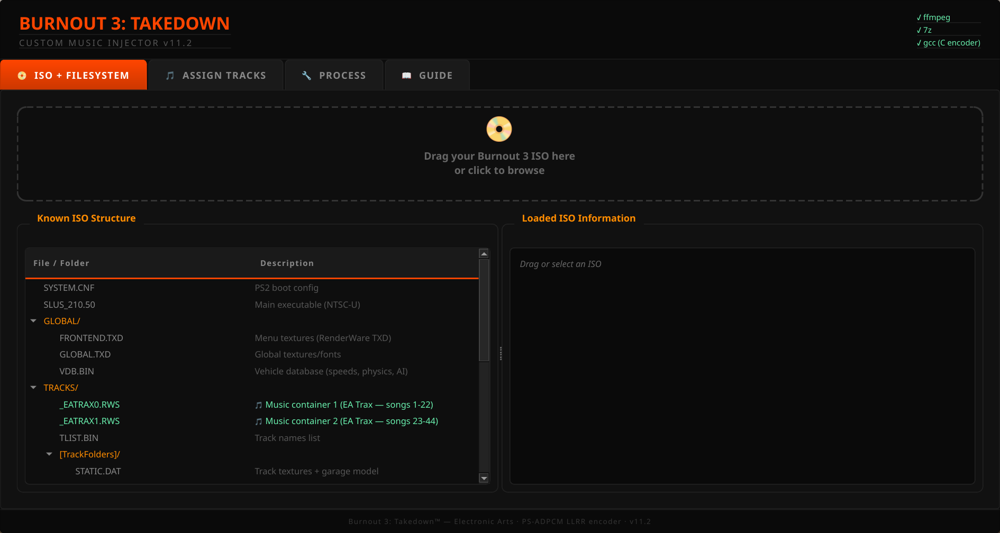
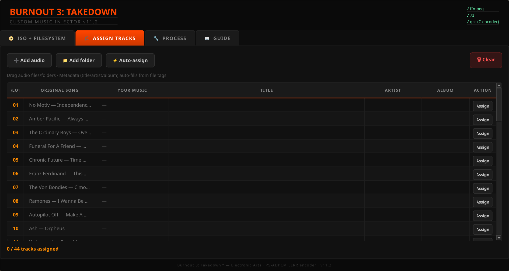
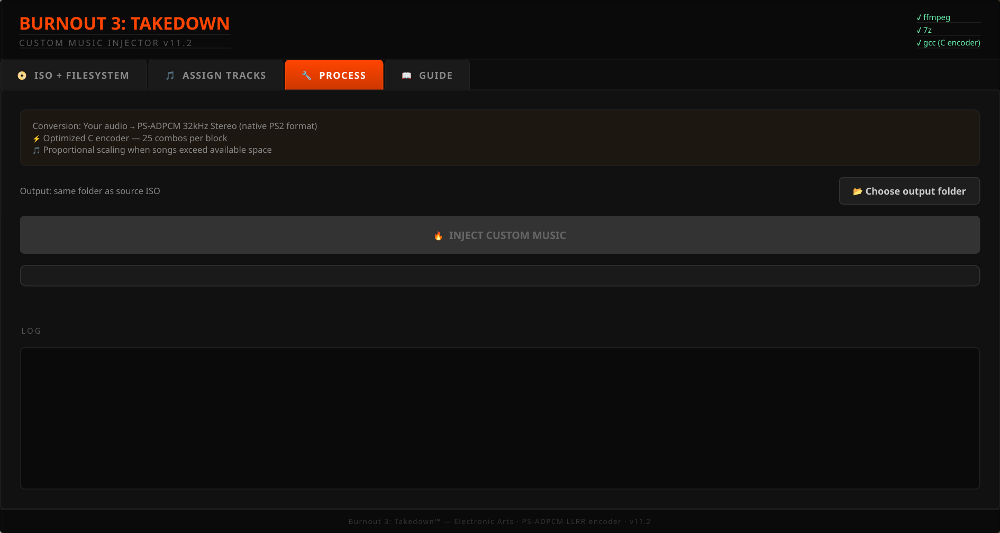

# 🏎️ Burnout 3: Takedown — Custom Music Injector

**Inject your own music into Burnout 3: Takedown (PS2) for PCSX2**


Replace the EA Trax soundtrack with your own music. Supports MP3, FLAC, M4A, OGG, WAV, OPUS, and more. Features a full GUI with drag & drop, automatic PS-ADPCM encoding, in-place ISO patching, and custom song name display.

**Three soundtrack modes** (see [Soundtrack Modes](#-soundtrack-modes)):
1. **Classic in-ISO** — replace the 44 EA Trax slots in a self-contained ISO (no cheats, runs anywhere). Fixed slot sizes (long songs are scaled).
2. **Portable full-length ISO** ✨ — 44 **full-length** tracks (no truncation) + **unlimited romanized names**, baked into one ISO that boots on **PCSX2, Android (AetherSX2/NetherSX2), and real PS2 — with zero cheats**.
3. **HostFS expansion** ✨ — add **N new tracks beyond 44**, full-length, unlimited names (plays from a host folder; needs PCSX2 cheats).

## 🎬 Demo

[](https://www.youtube.com/watch?v=bScxPc_APYo)

*Click to watch gameplay with custom music injected*

## 📸 Screenshots

### ISO + Filesystem


### Track Assignment


### Processing


## ✨ Features

- **44 track slots** — Replace any or all songs in the EA Trax playlist
- **Full-length tracks (portable)** — A surgical ISO builder relocates the enlarged EATRAX/GLOBALUS files to the disc end (every other file stays byte-identical at its original LBA), so songs play at full length with **no cheats and no HostFS** — the ISO boots anywhere
- **Add tracks beyond 44 (HostFS)** — Expand the playlist to N tracks via [Nahelam's HostFS patch](https://github.com/Nahelam/PS2-Game-Mods) (digit=track/22 ELF hook + relocated 24-byte metadata array + GLOBALUS string-table relocation)
- **Unlimited romanized names** — Relocated GLOBALUS string table removes the per-field length limit; a built-in romanizer (ICU `Any-Latin; Latin-ASCII` + pykakasi for Japanese) converts foreign-script titles to readable Latin/romaji automatically
- **Custom song names** — Title, Artist, and Album display in-game via GLOBALUS.BIN patching (UTF-16LE)
- **Auto metadata** — Title/Artist/Album auto-fill from audio file tags (ID3, Vorbis, etc.)
- **Any audio format** — MP3, FLAC, M4A, OGG, WAV, OPUS, WMA, AAC
- **PS-ADPCM encoder** — C-accelerated encoder with optimal filter/shift search (25 combos per block), integer-accurate predictor feedback
- **Multicore pipeline** — every song is converted and encoded in parallel across all CPU cores (~7× faster encoding on an 8-core machine)
- **Loudness matching** — 2-pass loudnorm brings custom music up to EA Trax's hot master level so it doesn't sound weak next to the original soundtrack
- **LLRR stereo layout** — Correct super-block format verified through reverse engineering
- **Dynamic RWS patching** — Track sizes in the RWS header are updated to match actual audio length
- **Proportional scaling** — When songs exceed available space, all are scaled evenly with fade-out
- **Character limit display** — Shows max characters per field with color coding (cyan = fits, orange = will truncate)
- **Output folder selector** — Choose where to save the custom ISO
- **In-place ISO patching** — No ISO rebuild needed, fast and safe
- **Drag & drop GUI** — PySide6/Qt6 interface with dark theme
- **Cross-platform** — Linux and Windows support

## 🔧 Installation

### Arch Linux
```bash
sudo pacman -S ffmpeg gcc python-pyside6
```

### Ubuntu / Debian
```bash
sudo apt install ffmpeg gcc python3-pip
pip install PySide6
```

### Windows
Install [Python](https://python.org), [ffmpeg](https://ffmpeg.org/download.html) and [MinGW](https://www.mingw-w64.org/) (for gcc). Then:
```bash
pip install PySide6
```

### Run
```bash
python3 burnout3_gui.py
```

The C encoder (`psxadpcm.c`) auto-compiles on first run via `gcc`. If `gcc` is not available, a Python fallback is used (slower).

## 📖 How to Use

1. **Load ISO** — Drag your Burnout 3: Takedown ISO (NTSC-U, SLUS-21050) to the ISO tab
2. **Assign Music** — Go to the **SOUNDTRACK** tab. The 44 originals are pre-loaded — assign a song to a slot to replace it, or add new ones. Title/Artist/Album auto-fill from metadata and auto-romanize.
3. **Build** — Pick one of the three build buttons (see below)
4. **Play** — Load the resulting ISO in PCSX2 (or, for HostFS, boot from the host folder)

## 🎶 Soundtrack Modes

All three live in the single **`🎶 SOUNDTRACK`** tab (pre-loads the 44 originals; replace any, add beyond):

| Build button | Tracks | Length | Names | Cheats? | Runs on |
|------|--------|--------|-------|---------|---------|
| 📀 **BUILD IN-PLACE ISO** | 44 (replace) | fixed-slot (scaled) | original byte-length | none · preserves CRC | PCSX2 / Android / PS2 |
| 💿 **BUILD PORTABLE ISO** ✨ | 44 (replace) | **full** | **unlimited (romanized)** | none | PCSX2 / Android / PS2 |
| 🛠 **BUILD HostFS** ✨ | **N (add beyond 44)** | **full** | **unlimited (romanized)** | `[HostFS]` + `[ELF Code Cave]` + `[EATRAX expansion]` | PCSX2 (PC) |

> **Why two builders?** Burnout 3 reads its loose disc files by **fixed LBA**, so a normal ISO rebuild black-screens. The portable builder works around this surgically (relocate only the path-opened EATRAX/GLOBALUS files to the disc end). Adding *new* files beyond 44 to the ISO isn't loadable by the game's CD path (it works via HostFS, which bypasses the disc filesystem) — so +tracks is HostFS-only for now. See [`BURNOUT3_EATRAX_HANDOFF.md`](BURNOUT3_EATRAX_HANDOFF.md) for the full reverse-engineering write-up.

## 🎵 Audio Format Details

| Property | Value |
|----------|-------|
| Codec | PS-ADPCM (PlayStation 2 native) |
| Sample Rate | 32,000 Hz |
| Channels | Stereo |
| Layout | LLRR (8192-byte super-blocks) |
| Block | L[2048] L[2048] R[2048] R[2048] |
| Nibble Order | First sample = LOW nibble, Second = HIGH |
| Compression | 3.5:1 (56 bytes PCM → 16 bytes ADPCM) |
| Encoder | 5 filters × 5 shifts = 25 combos per block |
| Pre-filter | Lowpass 15.5kHz (just under Nyquist) — keeps highs, tames aliasing |
| Resampler | soxr, 28-bit precision |
| Loudness | 2-pass loudnorm ~-10 LUFS — matches EA Trax's hot masters |

## 📊 Space & Scaling

| EATRAX | Slots | Fixed Size | Avg Duration/Slot |
|--------|-------|------------|-------------------|
| EATRAX0 | 1–22 | 149 MB | ~3.2 min |
| EATRAX1 | 23–44 | 150 MB | ~3.3 min |

- **Fewer songs = more space per song.** With 10 songs per EATRAX, most fit completely.
- **44 songs of ~5 min each**: scaled to ~74% (~3.5 min each) with automatic fade-out.
- The tool distributes space proportionally — no song gets silenced.

## 🏷️ Song Names

Custom song names are patched into `DATA/GLOBALUS.BIN` inside the ISO:

- **Slots 1–40**: Strings stored at offset `0xB700` in groups of 3 (title, album, artist)
- **Slots 41–44**: Strings stored separately at offset `0x2C004`
- **Character limit**: Each field has a fixed byte length inherited from the original string. Names longer than the limit are truncated.
- **Encoding**: UTF-16LE. Latin characters work perfectly. Japanese/CJK characters encode correctly but the NTSC-U font doesn't include those glyphs (shows as squares). Use romaji for Japanese song names.

## 🔬 Technical Notes

### RWS Container Format
The music is stored in `TRACKS/_EATRAX0.RWS` (tracks 1-22) and `TRACKS/_EATRAX1.RWS` (tracks 23-44) inside the ISO.

```
RWS Container (0x080D) {
  Audio Header (0x080E) {
    Track table @ 0x78: 32-byte entries
      [+0x18] track_size    — controls playback duration at runtime
      [+0x1C] track_offset  — cumulative byte offset into audio data
  }
  Audio Data (0x080F) {
    PS-ADPCM blocks in LLRR super-block layout
  }
}
```

Song duration is determined **at runtime** from the track size field in the RWS header — no executable patching required. This was confirmed by the Burnout modding community.

### LLRR Layout
Burnout 3 uses an unusual stereo interleave:
- **Not** standard L[2048] R[2048] alternating
- **Actual**: L[2048] L[2048] R[2048] R[2048] in 8192-byte super-blocks
- Confirmed by decoding original tracks with vgmstream and comparing energy patterns

### Nibble Packing
PS-ADPCM stores two 4-bit samples per byte:
- First sample → **LOW nibble** (bits 0-3)
- Second sample → **HIGH nibble** (bits 4-7)

Verified by byte-comparison against decoded/re-encoded original tracks.

## 📋 Known Limitations

- **Classic in-ISO mode** — EATRAX space is fixed (149 MB + 150 MB); songs are scaled proportionally when they exceed it, and names are limited to the original string's byte length. (The **Portable full-length** and **HostFS** modes remove both limits.)
- **+tracks beyond 44 is HostFS-only** — Adding *new* tracks past 44 works via HostFS but not yet in a self-contained ISO: the game can't load a newly-added disc file by path, and extending an existing `_EATRAX*.rws` track table breaks RenderWare's relocation. Cracking portable +tracks needs deeper RWS-audio-format / IOP RE (findings documented in `BURNOUT3_EATRAX_HANDOFF.md`).
- **NTSC-U only** — Currently supports the US version (SLUS-21050). PAL/JP versions have different offsets.
- **No CJK fonts** — The NTSC-U version doesn't include Japanese/Chinese/Korean font glyphs, so names are auto-**romanized** to Latin/romaji (which the font renders) instead of showing as squares.

## 🤝 Contributing

Contributions welcome! Areas that need help:

- **Portable +tracks** — The big open problem: load new EATRAX files (beyond 44) from a self-contained ISO. Either reverse the IOP CD file-lookup (why added files don't load) or model RenderWare's per-track audio relocation (to extend an existing `_EATRAX*.rws` track table). Full findings + dead-ends are in `BURNOUT3_EATRAX_HANDOFF.md`.
- **PAL/JP support** — Adding support for European and Japanese ISO versions (different ELF/GLOBALUS offsets)

Already done: ✅ full-length songs (portable ISO), ✅ HostFS integration for +tracks, ✅ unlimited romanized song names.

## 🙏 Credits & Acknowledgments

- **[Nahelam](https://github.com/Nahelam)** — [PS2-Game-Mods](https://github.com/Nahelam/PS2-Game-Mods) for Burnout 3 modding research, HostFS patches, and community support
- **burninrubber0** — RWS format documentation, song metadata research, and invaluable guidance from the [Burnout Wiki](https://burnout.wiki)
- **[AcuteSyntax](https://gist.github.com/AcuteSyntax/536a2d62ab1b3fde5c14f70d268b14c0)** — Burnout modding format documentation
- **vgmstream** — For confirming the audio codec and sample rate
- **EA / Criterion Games** — For making Burnout 3: Takedown, one of the greatest racing games ever

## 📄 License

MIT License

---

*This tool was developed with the assistance of AI (Claude by Anthropic) as a coding partner. The reverse engineering, testing, and verification were performed iteratively on real hardware/emulator setups.*

*This tool is for personal use with legally owned copies of Burnout 3: Takedown. No copyrighted game data is included.*